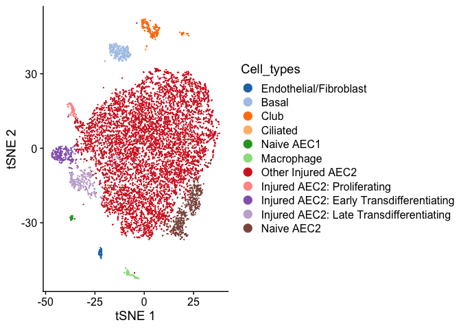

## Overview of single cell visualization tools

``` r
library(Seurat)
library(SingleCellExperiment)
library(iSEE)
library(tidyverse)
library(scbp) #remotes::install_github("rnabioco/scbp")
library(zellkonverter)
library(shiny)
library(presto)
```

## Example dataset

Single cell dataset from a study analyzed from Rachel Zemans’s lab
[GSE113049](https://www.ncbi.nlm.nih.gov/geo/query/acc.cgi?acc=GSE113049).
Mouse lungs were treated with LPS to induce an inflammatory lung injury
that stimulates regeneration of alveolar cells. Regeneration occurs via
trans-differentiation of type 2 cells into type 1 cells. The study
identified transitional cell states, some of which are found in human
lung regeneration associated diseases or infections (IPF or COVID19).
The code below will download a `Seurat` object and a `loupe` file for us
in this tutorial.

``` r
data_dir <- "data"
loupe_dir <- file.path(data_dir,  
                     "aggregated_data",
                     "outs", 
                     "count")
dir.create(loupe_dir, recursive = TRUE, showWarnings = FALSE)

loupe_fn <- file.path(loupe_dir, "cloupe.cloupe")
seurat_fn <- file.path(data_dir, "so.rds")

if(!file.exists(loupe_fn)){
  download.file("https://www.dropbox.com/s/b9k6bm1idwk8xpe/cloupe.cloupe?dl=1",
              loupe_fn)
}

if(!file.exists(seurat_fn)){
  download.file("https://www.dropbox.com/s/7mkg6a2jdhwa0ei/so.rds?dl=1",
              seurat_fn)
}
```

``` r
so <- readRDS(seurat_fn)
plot_tsne(so, "Cell_types")
```



## 10x Genomics Loupe cell browser

The Loupe cell browser is an interactive tool enabling exploratory data
analysis of datasets processed by `cellranger count` (single dataset) or
`cellranger aggr` (multiple datasets). By default `cellranger` will make
PCA, tSNE, and UMAP projections and perform clustering, which can be
visualized in loupe. However, newer versions of loupe now allow
investigators to upload custom projections and metadata (such as
clusters), which makes this tool much more useful.

Once a loupe file has been generated custom projections can be uploaded.
The loupe file can then be saved and shared with collaborators to easily
disseminate the dataset.

Loupe accepts csv formatted data for the projections and metadata. The
key step is to make sure that the 10x cell barcode matches between the
seurat object and the loupe file. Usually 10x will add integer suffixes
to the cell barcode based on the ordering of samples run through
`cellranger aggr` (e.g. `-1` for the file sample, `-2` for the second) .

    # format for projections (csv)
    #
    # Barcode,X,Y
    # AAACATACGGTACT-1,0.5,0.5
    # AAACATTGCTCGCT-1,0,0
    # AAACATTGGCGATT-1,-0.5,-0.5

``` r
mdata_to_export <- cbind(so@meta.data, so@reductions$tsne@cell.embeddings)

tsne_coords <- dplyr::select(mdata_to_export, Barcode, X = tSNE_1, Y = tSNE_2)

write_csv(tsne_coords, file.path(data_dir, "loupe_files", "tsne_coordinates.csv"))
```

    # format for metadata
    # Only can add categorical variables and there is an upper limit on catagories
    
    # Barcode,Graph-based,Other
    # AAACATACGGTACT-1,Cluster 1,a
    # AAACATTGCTCGCT-1,Cluster 14,b
    # AAACATTGGCGATT-1,Cluster 12,c

``` r
mdata_out <- dplyr::select(mdata_to_export,
                           Barcode,
                           Cell_types,
                           Experiment,
                           Condition,
                           Experiment_Id)

write_csv(mdata_out,
          file.path(data_dir, "loupe_files", "custom_mdata.csv"))
```

There is a loupe file for this dataset:
`data/aggregated_data/outs/count/cloupe.cloupe` that these annotations
can be uploaded to as an example.

## iSEE interactive shiny browser

From their docs:

> The `iSEE` package provides an interactive user interface for
> exploring data in objects derived from the `SummarizedExperiment`
> class. Particular focus is given to single-cell data stored in the
> `SingleCellExperiment` derived class. The user interface is
> implemented with [RStudio](https://www.rstudio.com)’s
> [*Shiny*](https://shiny.rstudio.com), with a multi-panel setup for
> ease of navigation.

`iSEE` uses `shiny` to build interactive html output that can hosted
most easily on a local computer. However a cloud server could also be
used to host an instance. Generally single cell data is too large to run
through free `shinyApps.io` accounts, so using `iSEE` with collaborators
is best done by installing R and dependencies on their local lab
computers.

`iSEE` is built to make it very easy to quickly generate an interactive
visualization.

``` r
# convert to singleCellExperiment
sce <- as.SingleCellExperiment(so)
app <- iSEE(sce,
            appTitle = "scRNA-seq analysis of lung regeneration",
            runLocal = TRUE)
```

``` r
runApp(app)
```

Note that you can save the state of an app as a `rds` file and reload it
later.

``` r
# to reload a saved state
state <- readRDS(file.path(data_dir, "iSEE_files", "iSEE_memory.rds"))
app <- iSEE(sce,
            appTitle = "scRNA-seq analysis of lung regeneration",
            initial = state$memory,
            runLocal = TRUE)
runApp(app)
```

## UCSC cellbrowser

From their docs:

> The UCSC Cell Browser is a fast, lightweight viewer for single-cell
> data. Cells are presented along with metadata and gene expression,
> with the ability to color cells by both of these attributes.
> Additional information, such as cluster marker genes and selected
> dataset-relevant genes, can also be displayed using the Cell Browser.

UCSC requires a set of custom files to be generated (matrix and metadata
files), then a command line tool will build static html which can be
hosted on a webserver. Once generated the static html do not require
additional dependencies besides a webserver making these easy to host
and maintain (e.g. by hosting on AWS S3 or github pages).

``` r
cb_data <- file.path(data_dir, "cellbrowser_files")
dir.create(cb_data, showWarnings = FALSE)

# metadata columns to retain
cols_to_keep <- colnames(so@meta.data)
cols_to_keep <- cols_to_keep[!cols_to_keep %in% c("cb", "Barcode")]
names(cols_to_keep) <- cols_to_keep

# make table of cell type markers
wilcoxauc(so, "Cell_types") %>%
  filter(logFC > 0,
         padj < 0.01) %>%
  group_by(group) %>%
  arrange(padj, logFC, .by_group = TRUE) %>%
  dplyr::slice(1:100) %>%
  write_tsv(file.path(cb_data, "mkrs.tsv"))

make_cellbrowser(so,
                 column_list = cols_to_keep,
                 project = "lung",
                 outdir = file.path(cb_data, "cb"),
                 marker_file = file.path(cb_data, "mkrs.tsv"),
                 ident = "Cell_types")
```

Once the matrix and metadata files are generated, the html is then built
using the command line tool `cbBuild` or a wrapper written in `R` from
the `scbp` package.

``` r
datasets <- file.path(cb_data, "cb", "lung", "cellbrowser.conf")

build_cellbrowser(datasets,
                  outdir = file.path(cb_data, "lung-cellbrowser"),
                  cbBuild_path = "/miniconda3/bin/cbBuild")
```

To load the dataset run the following on the command line with the `-p`
argument specifying a port to use.

``` bash
cbBuild \
  -i data/cellbrowser_files/cb/lung/cellbrowser.conf \
  -o data/cellbrowser_files/lung-cellbrowser \
  -p 8888
```

## cellxgene

Cellxgene is an interactive tool for exploring single cell datasets
built by the `Chan Zuckerberg Initiative`. It is a command line tool
written in python that takes a `h5ad` anndata file and generates a web
app to visualize/interact with the dataset. It is fast and scales to
millions of cells. Hosting a cellxgene instance is however complicated
and it is unclear what is the best approach to do this (see
[docs](https://chanzuckerberg.github.io/cellxgene/posts/hosted)).

To convert to a seurat object to a `.h5ad` it is easiest to first
convert to a `singleCellExperiment`, then use the `zellkonverter`
package to write to `.h5ad`.

``` r
sce <- as.SingleCellExperiment(so)

# need to rename projections to match scanpy format (e.g "X_pca", "X_umap")
reducedDimNames(sce) <- str_c("X_", tolower(reducedDimNames(sce)))

writeH5AD(sce,
          X_name = "logcounts",
          file = file.path(data_dir, "cellxgene_files", "so.h5ad"))
```

Then on the command line, launching the tool is very easy.

``` bash
cellxgene launch data/cellxgene_files/so.h5ad --open
```
